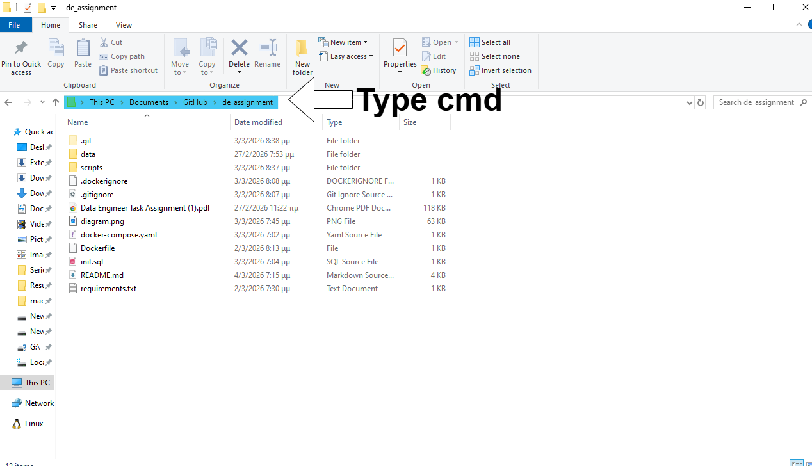

# DEUS EX MACHINE DE Assignment
A Python ETL project that loads csv files into a PostgreSQL database using pandas and docker.

This project uses Docker in order to create an application that runs solely on Docker, meaning that, if you have Docker installed, you can simply type in a cmd window inside the directory and it will build the database and its tables, read the files, fill the tables, and run the tasks that are described in the pdf assignment.

## How to run the Dockerfile
First, make sure you have **Docker open** and have downloaded the repository locally, then in the root directory (where the Dockerfile is), open a command line window as shown in the figure below:  

 and type the following command:  
`docker-compose up --build`
 

and then a bunch of lines will start appearing which they basically:
- Start the PostgreSQL database
- Execute `init.sql` to build the tables, their keys and indexes
- Create the Python 3.11 ETL container
- Wait for the db to be ready and start the transformation logics and fills the tables
- Lastly, it runs and prints the tasks inside the `process_data.py` (there is a 5 second time sleep in between the 5 tasks in order to take a quick look while it runs)

## CSV Files and Data transformation
Two csv files, `categories.csv` and `groceries.csv`, were provided and they were required to be deconstructed into tables with more coherent information, as shown in the following image.

 

To further ensure data integrity and query efficiency, primary keys and indexes have been implemented in order to quickly search and identify each row when complex joins and queries are running, and for when the data scales and grows larger. 
## Key Entity Relationships:
1. Members: Unique customers identified by a surrogate key and their original member_id.
2. Items: Products mapped to a hierarchical category structure.
3. Visits: A logical grouping of transactions. Per task requirements, all items purchased by the same member on the same date are consolidated into a single visit.
4. Sales: A fact table linking specific items to their respective visits.

In `items` table we basically take the categories file and rename the item column to item_name and with category with split the string based on the `/` character and map each different subcategory into a different level, for example:

Paper-Cleaning-Home/Cleaners-Supplies/All-Purpose-Cleaners ->   Cat_level_1=Paper-Cleaning-Home,  
Cat_level_2=Cleaners-Supplies,  
Cat_level_3=All-Purpose-Cleaners

 

In `members` table we took the distinct `member_ids` that are inside the `groceries.csv` file.

In `visits` table we used `member_id` and `visit_date` and created a serial unique primary key, `visit_id` to identify the unique pair, from the `groceries.csv` file.

Finally, `sales` table is a combination of `items` and `visits`, for which we created a unique serial primary key to identify the sale of an `item_name` during a specific visit by utilizing a foreign key relationship with `visit_id` from `visits` table.