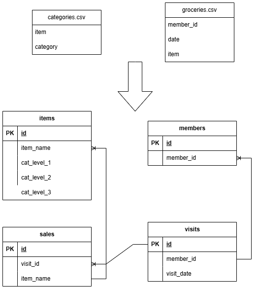

# DEUS EX MACHINE DE Assignment
A Python ETL project that loads csv files into a PostgreSQL database using pandas and docker.

This project uses Docker in order to create an application that runs solely on Docker, meaning that, if you have Docker installed, you can simply type in a cmd window inside the directory and it will build the database and its tables, read the files, fill the tables, and run the tasks that are described in the pdf assignment.

## How to run the Dockerfile
First, make sure you have Docker open, then in the directory where the Dockerfile is, open a command line window and type the following: 
`docker-compose up --build` 
and then a bunch of lines will start appearing which will:
- Start the PostgreSQL database
- Execute `init.sql` to build the tables, their keys and indexes
- Create the Python 3.11 ETL container
- Wait for the db to be ready and start the transformation logics inside the `process_data.py`

## CSV Files and Data
